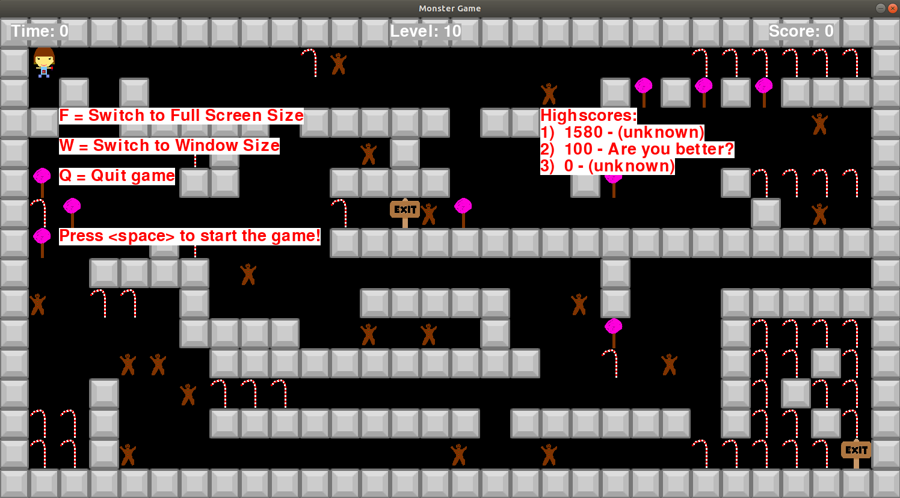
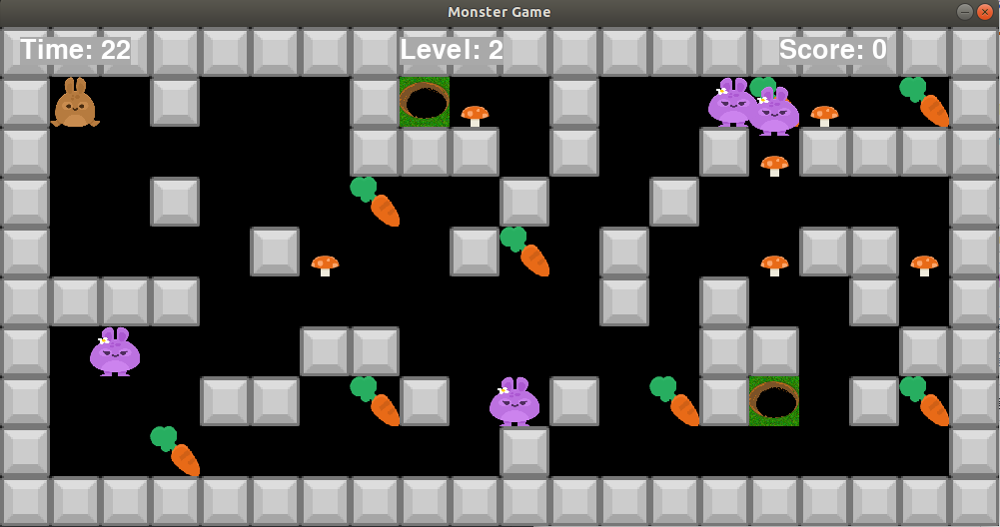
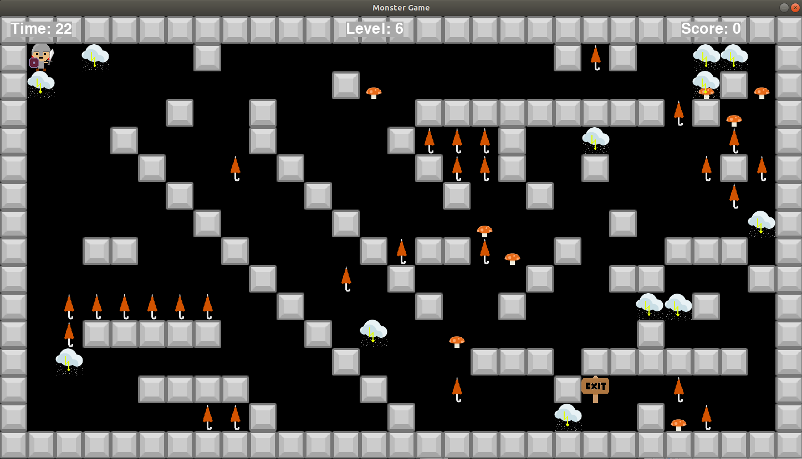

# pgzero monster game - Intro

This is a python game based on the library pgzero ([Pygame zero](https://pygame-zero.readthedocs.io/en/stable/index.html)) created in a python learning project during the school holidays 2019

Dieses Spiel ist das Ergebnis eines Python-Lern-Projekts in den großen Schulferien 2019. Es basiert auf der Bibliothek pgzero ([Pygame Zero](https://pygame-zero.readthedocs.io/en/stable/index.html)).

Ziel des Spiels ist es, in einem Irrgarten möglichst viele Punkte durch Sammeln von Objekten zu bekommen, um den Highscore anzuführen.

Aber Vorsicht, Monster verfolgen dich. Wenn du sie berührst, ist das Spiel vorbei!

# Entwickler

- Level designs und Grafiken: S + M
- Testing: S + M + C
- Game Engine Programming: #Daddy + S

Das Spiel wurde unter **Ubuntu-Linux** entwickelt, ist aber auch auf Windows und Mac OS-X lauffähig.

Die eigenen Grafiken wurden mit dem kostenlosen (Open-Source-)Malprogramm [Pinta](https://pinta-project.com/pintaproject/pinta/) erstellt bzw. verändert.

# Installation

1. Python 3 installieren auf deinem Computer

   Z. B. von hier runterladen: https://www.python.org/downloads/

2. Pygame Zero installieren

   In der Kommandozeile ("Terminal") eingeben:

    pip install pgzero

3. Das Spiel runterladen

    Siehe Download-Link oben rechts.
    Dann die Datei in einem Ordner auspacken ("entzippen")

# Starten des Spiels

  Öffne eine Kommandozeile in dem Verzeichnis, in dem du die runtergelandenen Dateien ausgepackt hast.
  
  Starte das Spiel mit
  
    python3 monster_game.py

# Spiele mit Python programmieren lernen

Das folgende Buch wurde verwendet, damit die Kinder Python und die Spiele-Entwicklung mit `pgzero` lernen:

[Spiele mit Python® supereasy programmieren](https://www.dorlingkindersley.de/buch/carol-vorderman-spiele-mit-python-supereasy-programmieren-9783831036752)

Das Buch ist auch in der englischen Original-Ausgabe verfügbar

# Lizenz

## Quellcode des Spiels und selbst erstelle Bild-Dateien

Dieses Spiel wird als Open Source mit der GPLv3-Lizenz veröffentlicht.
Das bedeutet, du kannst den Quellcode

- studieren
- verändern
- veröffentlichen

solange du ein paar Spielregeln einhältst, welche in der [Lizenz-Datei](LICENSE) beschrieben sind.

## Fremde Bild-Dateien

Die meisten Bild-Dateien stammen von Kenney Vleugels und können kostenlos runtergeladen und verwendet werden von:

www.kenney.nl

Diese Bilder stehen unter folgender Lizenz:

>	License (Creative Commons Zero, CC0)
>	http://creativecommons.org/publicdomain/zero/1.0/
>
>	You may use these graphics in personal and commercial projects.
>	Credit (Kenney or www.kenney.nl) would be nice but is not mandatory.
>
>	Donate:   http://donate.kenney.nl/
>
>	Request:  http://request.kenney.nl/

# Screen shots

